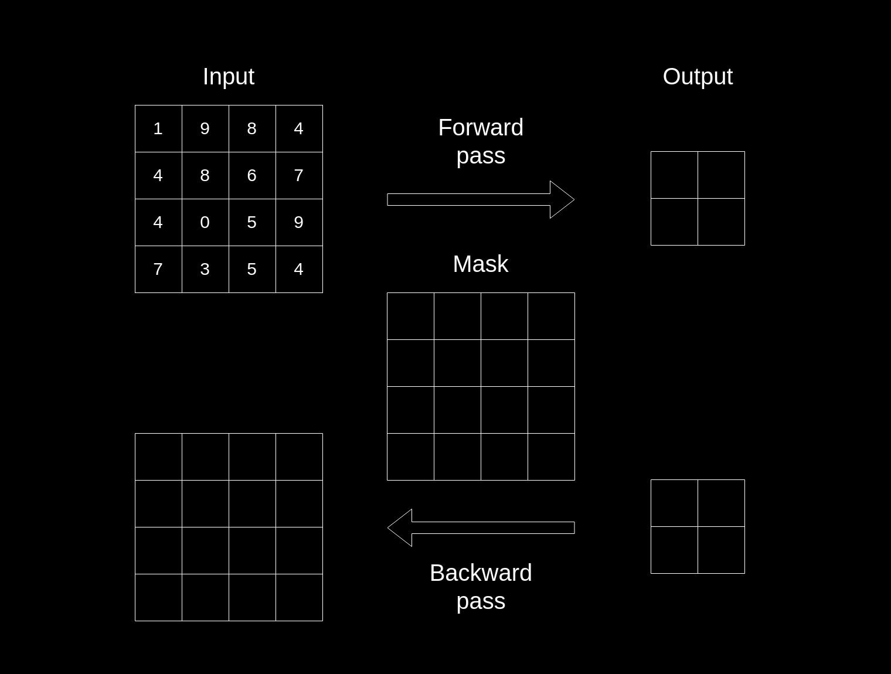

<h1 align="center">Hi there 👋, I'm Arifin</h1>
<h3 align="center">AI/ML Engineer | Computer Vision | ROS Developer | Backend Developer</h3>

  

  
  

---

### About Me

- I'm passionate about **AI/ML, Computer Vision, and Robotics**
- Currently working with **ROS (Robot Operating System)**
- Always learning and exploring new technologies
- Backend development enthusiast
- Goal: Build intelligent autonomous systems

---

### 🛠️ Technologies & Tools

#### Languages

#### AI/ML & Computer Vision

#### Robotics

#### Backend & Databases

#### Mobile Development

#### Tools & Platforms

---

### 📊 GitHub Stats

  

  

---

### 📫 Connect with Me

  
  
  

---

  <i>⭐️ From <a href="https://github.com/arilix">arilix</a></i>

